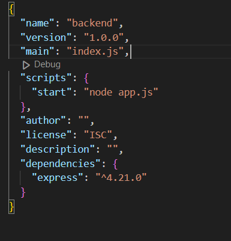
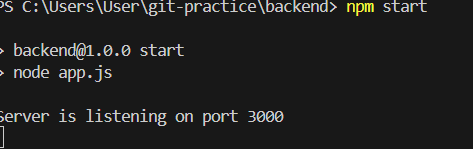

# package.json:

依照 CommonJS 規定敘述資料夾的文件內容，裡面包含應用程式名稱、版本、描述、關鍵字、授權、貢獻者、維護者、腳本和相依套件等。

- dependencies: 所下載的 npm 套件，裡面記錄著安裝的套件及版本。

- devDependencies: 只在**測試或開發**時所需要安裝的套件。

- scripts: 自訂常用指令，可減少正常所需的指令量。  
   自訂義:  
   執行結果:

- 環境變數: 建立 .env 檔，並安裝 dotenv 等可以讀取 .env 檔的工具，之後新增下段程式，就可以順利讀取裡面內容

```
require("dotenv").config();
const port = process.env.PORT;
```

# 哪些東西需要上傳至 git?

我覺得除了會影響自身利益(像是帳號等)、所使用的套件(因為內容物過大且屬於公開資源，所以只需提供使用哪些和版本即可)和對程式運行沒有幫助的檔案以外都能上 git

# CJS vs ESM

- CJS: 在執行程式時，根據需要動態加載模組

匯出模組時

```
module.exports = { moduleName };
```

匯入模組時

```
const { moduleName } = require("./moduleName.js");
```

- ESM: 在一開始就知道需要哪些模組
  需要在 package.json 加入

```
"type": "module"
```

匯出模組時

```
export default class moduleName{
    //functions
}
```

匯入模組時

```
import moduleName from "./moduleName.js";
```
