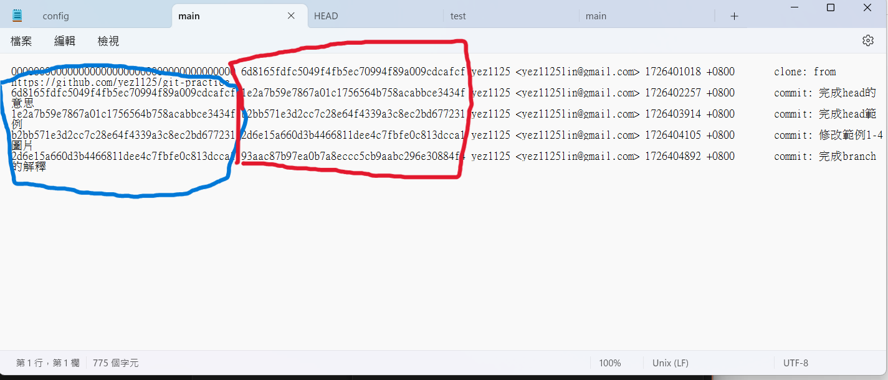
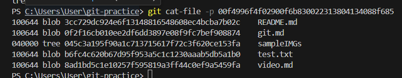
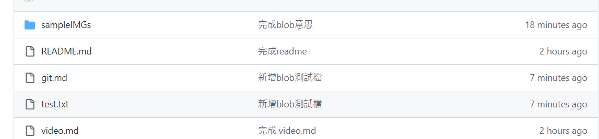

# 1.說明 blob, tree, commit, branch, head 分別是什麼

## 1.**branch**:由選取版本複製出來的版本，在此版本所做的更動*不會影響*其他版本的內容

舊分支版本:  
新分支版本:

## 2.**head**:目前檔案所在的分支，並且紀錄目前最新版本

更改分支前:  
分支版本:  
更改分支後:  
分支版本:

## 3.**commit**:已提交至 git 的版本(藍色部分為前一版本 紅色部分為提交後版本)

版本:

## 4.**blob**:所新增至 git 的*內容*

## 5.**tree**:所新增至 git 的*資料夾*

檔案格式:   
所對應 github 上內容:

# 2.commit message 應該怎麼寫比較好？應該有什麼 style 嗎？

commit message 應該精簡，字數要少但別人可以一眼就看出你更動了什麼東西  
至於 style 的部分則依所合作的團隊而定，像是語言或是專業術語等
