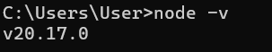
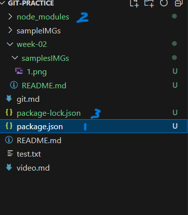
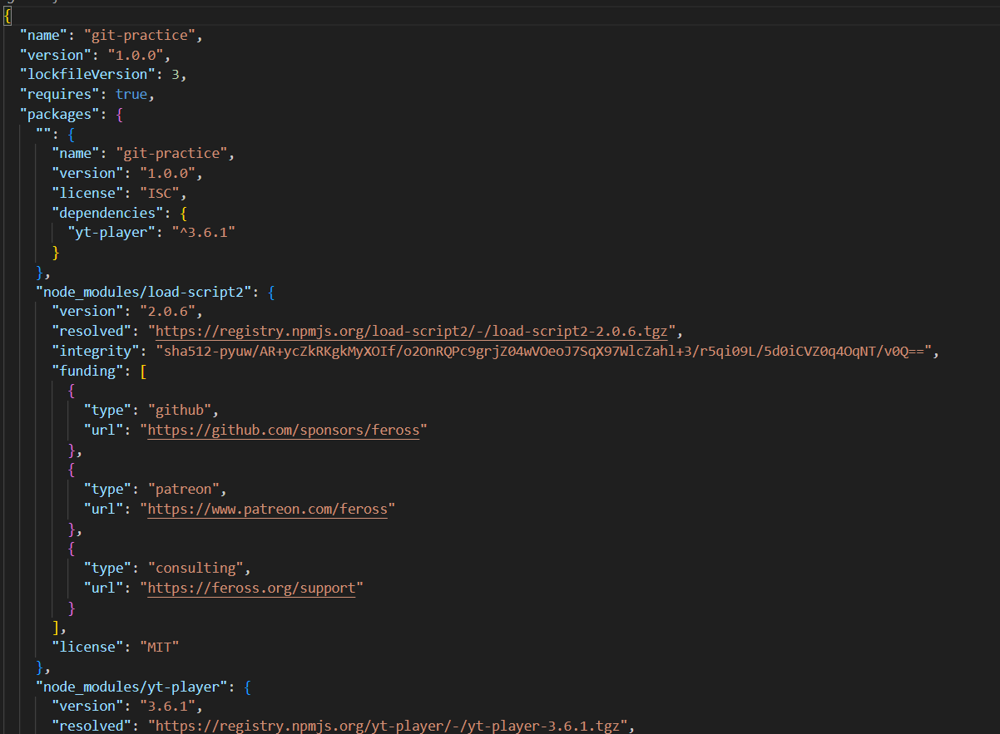

我的 node.js 選擇下載 v20.17.0 的版本

# 為什麼選擇此版本?

它是最新版本的 LTS(Lond-term support)版本，系統方會長期維護，而且進入到 LTS 版本就代表此版本已經不會有過多的更改，整體的系統是相對穩定的。而目前沒有要使用新功能的打算，故使用此版本，減少因系統不成熟而出錯的可能。

# nvm V.S. npm

1. **nvm*(node version manager)*:**node.js 的版本管理器，可以切換 node 的版本，可以用來測試程式在不同版本下的 node 是否可以順利運作

2. **npm*(node package manager)*:**模組管理器，管理以 node.js 所開發的模組  
   使用'npm init'時，會新增*package.json*的檔案(如圖一標示 1、圖二)，裡面會記錄所下載的模組以及其他資訊，當下載第一個模組時，會新增*node_modules*和*package-lock.json*(如圖一標示 2、3)，*node_modules*會放模組的程式(圖三)，*package-lock.json*會放模組更細節的資訊(圖四)
   圖一:
   圖二:
   圖三:
   圖四:
