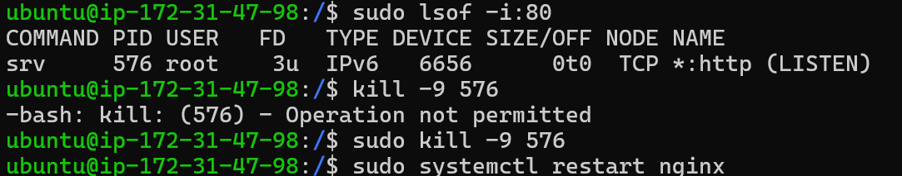
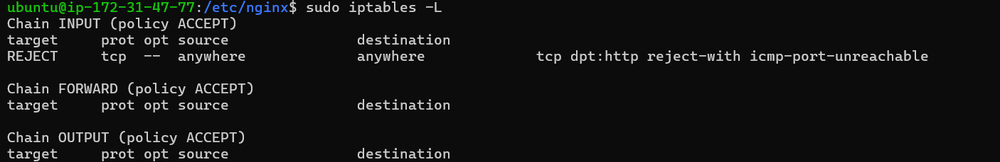

# 第一個問題

**問題:**  

發現是 /etc/nginx/nginx.conf 裡多一個";"，所以切進去看。  
**解決辦法:**  
  
刪掉就將問題一解決

# 第二個問題

**問題:**  
  
發現 80 port 已被別人占用  
**解決辦法:**  


```
sudo lsof -i:80 #查詢是哪個東西占住80 port
sudo kill -9 PID #利用上述查詢到的 PID 去 kill 該程序
```

# 第三個問題

**問題:**  
  
發現還是連不上去
**解決辦法:**  
往連線方面去想，可能跟防火牆有關係(上次同學踩得坑...)

發現拒絕 TCP 連線，所以用以下指令更改

```
sudo iptables -I INPUT -p tcp --dport 80 -j ACCEPT
```

# 問題四

**問題:**  
  
nginx 已順利重啟但頁面出現 403  
**解決辦法:**  
  
403 代表著使用者沒有權限去存取，所以要回到 /etc/nginx/nginx.conf ，去更改 user 的權限。

# 最終結果


# 心得

在一開始的時候，其實對該如何修復完全沒有想法，不知道該從哪裡下手，所以就先從自己有學過跟 nginx 相關的指令下手。就成功看到原因，之後的步驟就比較有頭緒。在完成後再回過頭來看，這一次的問題大多數好像都有學過，再搭配相關的查詢，其實就可以找到解答。反思了一下，未來在搶修的這部份其實要靠大量的經驗和先備知識才有辦法可以快速找到答案，而且在高壓的情況下肯定沒有辦法很順暢思考，若沒有經驗和知識，即使給了 log 也沒辦法找到答案。雖然學校有相關的課程，但都只是講概念，所以在應用上比較陌生，真的只有遇到問題並解決才會知道原來是這樣，這就是事情教會人成長吧。
